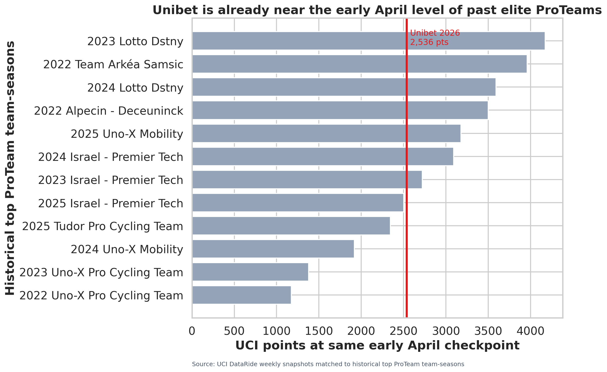
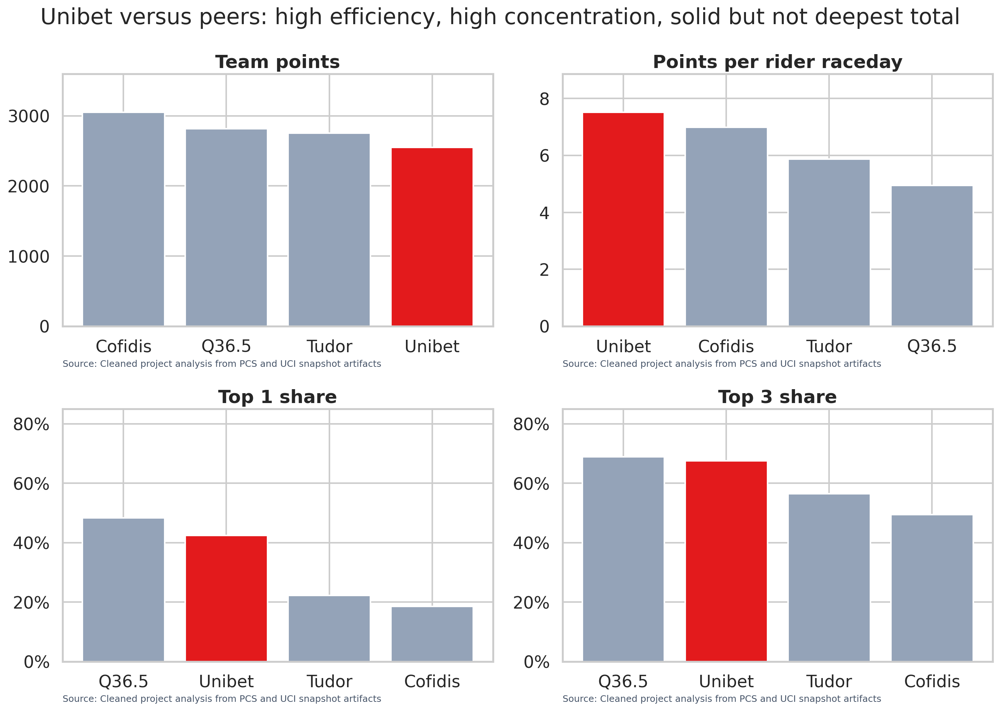
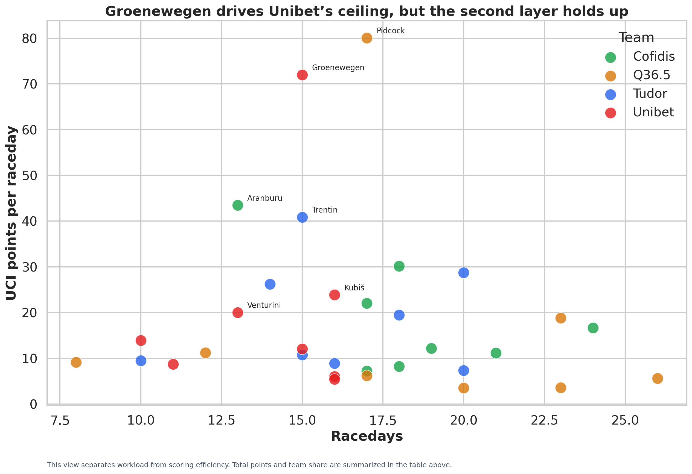
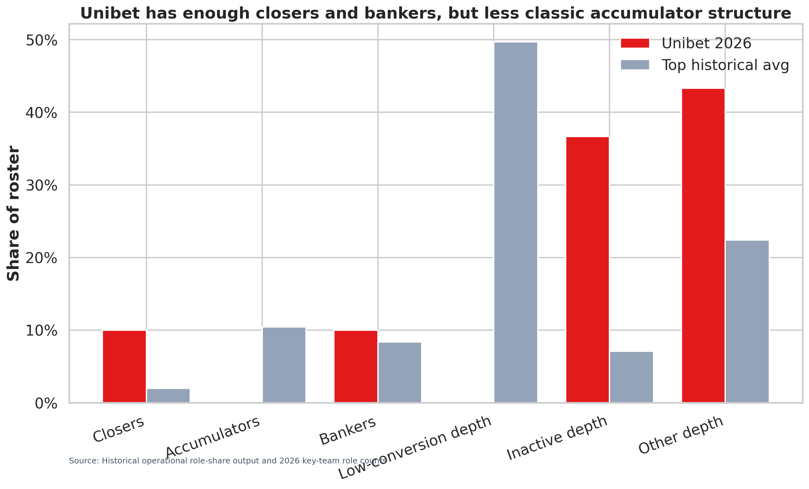
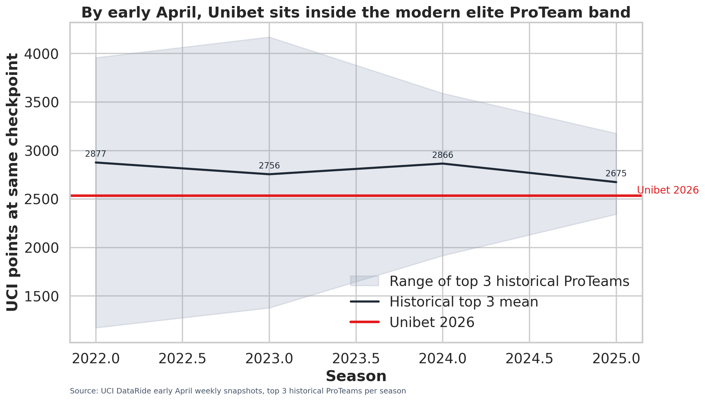

# Unibet have built a real early-season case. The question is how deep it runs.

*By medium.com/@jonathankriertranthankrier*

*Data last pulled: 07 April 2026. Historical comparison snapshots are aligned to comparable early-April dates in each benchmark season.[1]*

By the first week of April, **Unibet Rose Rockets had 2,536 UCI points**, which puts them at roughly **91 percent of the historical early-April average** posted by the strongest recent ProTeams in this benchmark.[1] For a broad audience, the most important point is simple. This is not a novelty run, and it is not a case of a team looking busy without producing much. Unibet have already built an early-season total that belongs in a serious historical conversation.[1]

That does not mean every part of the profile is equally convincing. It means the debate has to start from a stronger place. **Unibet look like a genuinely good ProTeam right now. The open question is whether they look like a durable one.**

This piece is built around that question. If Unibet are already scoring at a historically strong April pace, what does the roster behind those points actually look like? Does it resemble the deeper ProTeam models that tend to hold up across a long season, or does it still lean too heavily on a narrow core?[2] [3] [4]

## The easiest place to start is the April benchmark

A lot of cycling analysis goes wrong when a live April total gets compared with a finished October total. This article does not do that. It compares **Unibet's current early-April snapshot** with **early-April snapshots from the best ProTeams in recent seasons**.[1] That makes the benchmark much easier to understand. It is not asking whether Unibet have already matched a full historical season. It is asking whether they are already tracking close to the kind of start that strong ProTeams used to make.[1]

| Metric | Unibet 2026 | Historical benchmark context | Why it matters |
|---|---:|---:|---|
| Early-April UCI snapshot points | 2,536 | Historical best-ProTeam mean: 2,793 | Unibet are already near a strong historical pace [1] |
| Share of historical mean | 90.8% | NA | The current total sits close to elite recent precedent [1] |
| Current peer position in this four-team comparison | 4th of 4 | Behind Cofidis, Q36.5, and Tudor on raw total points | Raw total alone does not tell the full story [4] |
| Team points per rider raceday | 7.52 | Highest among Unibet, Tudor, Cofidis, and Q36.5 | Unibet have been exceptionally efficient with their race exposure [4] |

The headline is not just that Unibet are having a nice opening. It is that **their opening is already strong enough to be measured against the best recent ProTeam starts without looking out of place**.[1]

## What this analysis uses, in plain language

The dataset behind this article combines **team-level UCI points snapshots**, **rider-level points totals**, **raceday counts**, and **team ranking snapshots** from the 2022 through 2026 ProTeam seasons.[1] [3] [4] At team level, the most useful inputs are total counted UCI points, team rank, and concentration measures such as how much of a team's score comes from its top one, top three, or top five riders.[1] [3] [4] At rider level, the key inputs are each rider's current points, racedays, and share of team scoring, which makes it possible to look at both performance and roster shape.[2] [4]

The main term that needs translation for a wider audience is **points per raceday**. It is simply an efficiency measure. It asks how many UCI points a rider or team produces for each day of racing. A team can build a decent total by racing a lot. A team that builds a big total while also scoring heavily per raceday is doing something more impressive. It is turning opportunity into value at a very high rate.[2] [4]

That matters here because this article is really about roster construction. It is trying to answer a basic sporting question: **is Unibet succeeding because the whole team is functioning well, or because a few riders are converting at an exceptional level?** The answer, at least so far, sits somewhere in between.[2] [3] [4]

## Unibet's strongest case begins with efficiency

In the current four-team comparison against **Cofidis, Tudor, and Q36.5**, Unibet rank fourth on raw points total.[4] Cofidis lead the group with **3,050 points**, followed by **Q36.5 on 2,817**, **Tudor on 2,752**, and **Unibet on 2,548**.[4] If the article stopped there, the story would look ordinary.

It should not stop there, because the more revealing number is how efficiently those points are being built. **Unibet lead the group in team points per rider raceday at 7.52**, ahead of **Cofidis on 7.00**, **Tudor on 5.87**, and **Q36.5 on 4.94**.[4] In other words, Unibet are getting more scoring value per unit of race exposure than any team in this peer set.[4]

That is not just a local quirk inside this four-team comparison. In the broader historical panel used for this project, top-tier ProTeams from 2022 through 2026 averaged **3.94 team points per rider raceday**, while bottom-tier teams averaged **1.02**.[3] Unibet's current figure sits well above that top-tier historical average, which is why their start deserves to be taken seriously.[3] [4]

| Current peer comparison | Cofidis | Q36.5 | Tudor | Unibet |
|---|---:|---:|---:|---:|
| Team points | 3,050 | 2,817 | 2,752 | 2,548 |
| Team points per rider raceday | 7.00 | 4.94 | 5.87 | **7.52** |
| Top 1 share | 18.5% | 48.3% | 22.3% | **42.4%** |
| Top 3 share | 49.4% | 68.9% | 56.5% | **67.6%** |

So the first broad-audience takeaway is straightforward. **Unibet are not just collecting points. They are collecting them very efficiently.** The complication is that the points are still flowing through a fairly concentrated part of the roster.[4]

## Groenewegen is the headline, but he is not the whole story

Every reading of Unibet's season has to begin with Dylan Groenewegen. He has scored **1,080 UCI points in 15 racedays**, which works out to **72.0 points per raceday**.[4] That is a massive number, and it explains why the team ceiling looks so high.[4] If a casual reader only remembers one name from this article, it will probably be his.

But stopping there would miss what makes the season more interesting. This is not a pure one-rider plot. **Lukáš Kubiš has added 382 points**, **Clément Venturini 260**, and **Jelle Johannink 181**.[4] Lander Loockx has also been efficient in a smaller role.[4] That is not the profile of a hollow roster. It is the profile of a team with a real second layer, even if that layer is not yet as deep as the best historical models.[4]

| Rider | UCI points | Racedays | Points per raceday | Team share | What it means for the article |
|---|---:|---:|---:|---:|---|
| Dylan Groenewegen | 1,080 | 15 | 72.0 | 42.4% | Elite finisher driving the team ceiling [4] |
| Lukáš Kubiš | 382 | 16 | 23.9 | 15.0% | Strong second-line scorer [4] |
| Clément Venturini | 260 | 13 | 20.0 | 10.2% | High-value support behind the lead rider [4] |
| Jelle Johannink | 181 | 15 | 12.1 | 7.1% | Productive next layer rather than empty depth [4] |
| Lander Loockx | 139 | 10 | 13.9 | 5.5% | Useful efficient support in limited exposure [4] |

This chart separates **workload** from **efficiency**. The horizontal axis shows racedays, while the vertical axis shows points per raceday. Total points and team share stay in the table above, where they are easier to read directly without repeating the same information through multiple visual cues.[4]

That is why the fair reading is not that Groenewegen is dragging a weak team behind him. The fair reading is that **Groenewegen sits on top of a genuinely productive upper layer, but the support below him is still thinner than it would be on the deepest and safest ProTeam models**.[4]

## The real issue is not quality. It is concentration.

This is the point where Unibet begin to drift away from the strongest long-run templates. Their top rider currently accounts for **42.4 percent** of team points, and their top three riders account for **67.6 percent**.[4] Those are not disaster numbers, especially when set next to **Q36.5**, whose top rider share is even higher at **48.3 percent**.[4] But they are still much more concentrated than what the better-balanced teams in this comparison are carrying.[4]

Cofidis sit at **18.5 percent top-1 share** and **49.4 percent top-3 share**. Tudor sit at **22.3 percent** and **56.5 percent**.[4] In the broader historical panel, top-tier ProTeams averaged **22.5 percent top-1 share** and **46.6 percent top-3 share**, while bottom-tier ProTeams averaged **44.0 percent** and **70.3 percent**.[3] Unibet therefore combine a clearly top-tier efficiency profile with a concentration profile that still looks much closer to the fragile end of the historical range.[3] [4]

> **That is the central tension of the season. Unibet are scoring like an elite team, but distributing those points more like a team that still needs another layer of protection.**

For a general reader, the point is simple. A team can be very good and still be vulnerable. That is what the Unibet profile looks like right now.

## Why middle depth matters so much

The best recent ProTeams were not only star-led. They usually had a larger middle class of useful scorers.[3] In the 2022 through 2026 historical panel, top-tier teams averaged **0.707 anchors, 1.433 engines, and 4.080 bankers**, while bottom-tier teams averaged only **0.033 anchors, 0.113 engines, and 0.920 bankers**.[3] In plain language, the strongest teams did not just have a star. They had enough riders below the star to keep the points coming week after week.[3]

The role model used in this project tries to make that visible. The names are analytical shortcuts, but the idea is easy to grasp. Some riders finish off races at a very high rate. Some can keep stacking useful scores across a heavier schedule. Some provide steady supporting value. And some parts of the roster have not turned race exposure into much yet.[2] [7]

| Operational role | What it means in simple terms | What the data says about Unibet |
|---|---|---|
| Closers | Riders who can score heavily and efficiently without needing a huge number of racedays [2] | Clear strength. Unibet have **3 closers**, which helps explain how quickly they built this start [7] |
| Accumulators | Riders who can keep adding meaningful points across a larger block of racing [2] | Clear gap. Unibet have **0 accumulators**, which is the clearest sign that the middle of the roster is still thin [7] |
| Bankers | Dependable supporting scorers who reduce pressure on the headline names [2] | Useful support. Unibet have **3 bankers**, so this is not only a one-rider team, but the layer is not yet especially thick [7] |
| Low-conversion depth | Riders who are racing but not turning much of that opportunity into points [2] | Not a major problem at the moment. Unibet have **0 riders** here [7] |
| Inactive depth | Riders with limited racedays and limited scoring so far [2] | Important context. Unibet have **11 riders** here, so a large part of the roster has not contributed much yet [7] |
| Other depth | Riders whose current profile is mixed or still unclear [2] | A watchpoint. Unibet have **13 riders** here, which means much of the roster has not yet become clearly productive middle-tier value [7] |

What matters most here is not the terminology itself. It is the shape of the roster that the terminology reveals. **Unibet are not short on top-end quality. They are short on a thicker scoring middle.** The absence of accumulators is the clearest sign of that, and the large inactive or unclear group shows how much of the roster is still waiting to become meaningful value.[2] [7]

That is also why the situation is more promising than bleak. It is easier for a team that already has elite finishing power to strengthen the supporting layer than it is for a flat team to invent a true closer from nothing.

## The historical band changes the tone of the conversation

There is a big difference between saying a team has had a lively April and saying it is already moving at a pace that resembles elite historical precedent. **Unibet belong in the second category**.[1]

Across the top three ProTeams at the same early-April checkpoint in each benchmark season, Unibet already sit inside the modern elite band rather than below it.[1] That does not settle what happens next. It does establish that skepticism now needs to be more precise. The issue is no longer whether the team is genuinely strong. The issue is what kind of strong team it is.[1]

This chart also needs one clear note for readers who are new to the method. The shaded band is a small benchmark sample, but it is a purposeful one because it tracks the **top 3 ProTeams at the same early-April checkpoint in each season**.[1] Read that band as the spread inside the elite early-season group for each year. On that reading, the group is much wider in **2022** and **2023**, still fairly wide in **2024**, and noticeably tighter by **2025**.[1]

That helps explain why Unibet's current line matters. It is not simply above a random past average. It sits inside the recent top-end range of relevant early-season ProTeam performances.[1]

## What would make the story stronger from here?

If Unibet want this season to look less like a brilliant opening and more like a historically durable ProTeam year, the path is fairly clear. They need one or two more riders to become meaningful scorers, or they need the current banker layer to keep converting often enough that the concentration numbers start to come down.[4] [7]

| Desired shift | Why it matters |
|---|---|
| Lower top-1 share | It would reduce how much the team depends on Groenewegen |
| Lower top-3 share | It would show a broader and safer scoring base |
| At least one true accumulator emerging | It would make the roster look more like the deeper historical templates |
| Banker layer continuing to convert | It would preserve efficiency while making the team less fragile |

This is the right place to be careful. The evidence does not say that Unibet must broaden immediately or collapse. It says something narrower and more useful. **The best historical ProTeams usually had more insulation in the middle of the roster than Unibet currently have**.[3] [7]

## The clearest conclusion

So far, **Unibet Rose Rockets are having a legitimately strong 2026**, and the same-date historical comparison helps show why.[1] Their early-April total is real. Their efficiency is exceptional. Their lead rider has been outstanding. And the support behind him is strong enough that this is not just a one-man spike.[1] [4]

But the historical comparison also sharpens the limit of the current model. The best long-run ProTeams usually spread more useful scoring across the middle of the roster. They carry less concentration risk, and that makes it easier for a strong spring to survive the long calendar that follows.[3] [4] [7]

That leaves Unibet with a profile that is both encouraging and unfinished.

> **The praise is easy. Unibet have already built an early-season total that belongs in a strong historical conversation. The caution is just as clear. They still rely more heavily on a narrow core than the deepest ProTeam models usually did.**

For a broad cycling audience, that is the cleanest way to frame the season right now. Unibet look real. They look dangerous. They look efficient. The next question is whether they can turn that sharp opening into something broader, steadier, and more convincing by the time the season matures.

## References

[1]: ../analysis/unibet_snapshot_vs_best_historical_proteams.csv "Unibet snapshot versus best historical ProTeams"
[2]: ../docs/refined_rider_roles.md "Refined rider roles report"
[3]: ../docs/latest_historical_proteam_analysis.md "Latest historical ProTeam analysis"
[4]: ../analysis/key_proteams_latest_comparison.csv "Key ProTeams latest comparison"
[5]: ../docs/unibet_vs_best_historical_context.md "Unibet versus best historical context"
[7]: ../analysis/historical_operational_role_share_by_rank.csv "Historical operational role share by rank"
